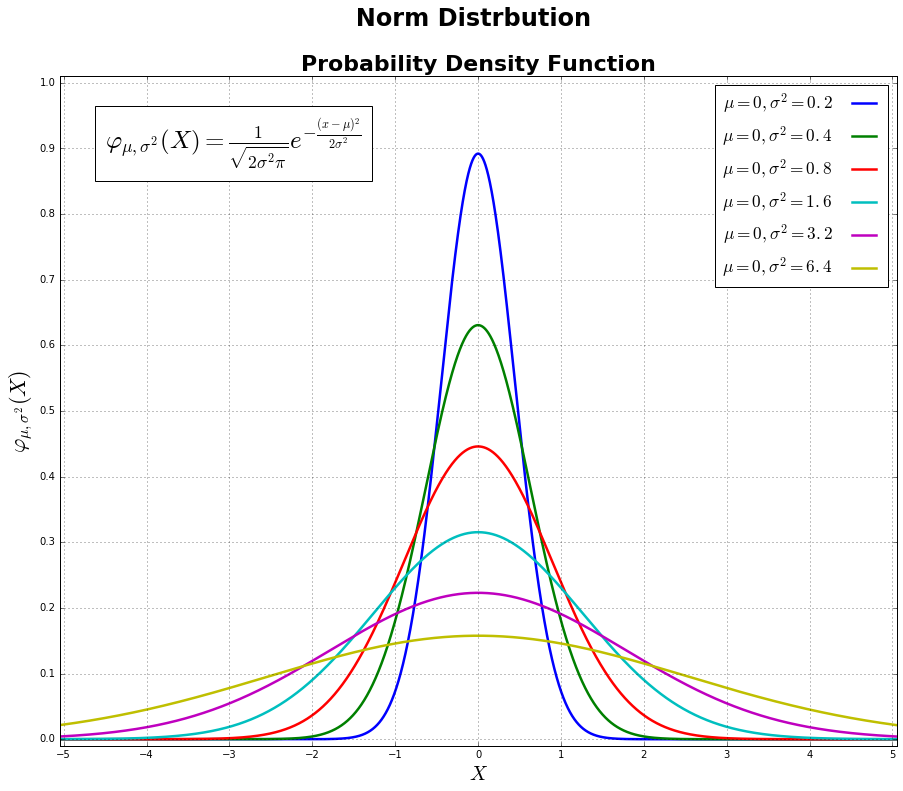

For Houcheng

CLARITY

This plot has very clear label, various color and beautiful visualization.  Besides, the mu and sigma of each line is apparently displayed, same as the formula, making the audience understand what the plot is showing.

ESTHETIC

Six different norm distributions have been shown in a very colorful but precise visualization.  It makes audience understand what is norm distribution looks like.

HONESTY

The plot can indicate differences of each norm distribution in various sigma. If there is an interactive function, for example, we can input our mu and sigma so that we can see the change by adjusting its values and understand the distribution better.
